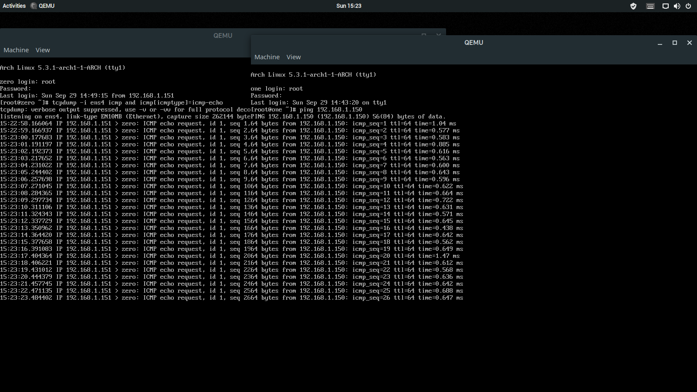

# Virtual Network with QEMU and Archlinux

There doesn't seem to be any Archlinux-focused virtual network tutorials with QEMU around. This is unfortunate, because Arch uses [`netctl`][1] which is different from the usual `/etc/network/interfaces` shown in Debian/Ubuntu tutorials. The network created here consists of two virtual machines capable connecting to each other through the virtual network while simultaneously being able to access the internet.

We use `qemu-img` to create a disk image for our virtual machine. We will use `qcow2` file format which is QEMU's native image format. `qcow2` stands for QEMU Copy On Write and it only allocates memory on the disk when its actually necessary, which makes it equivalent to a dynamically allocated disk on Virtual Box.

    [user@host ~]$ qemu-img create -f qcow2 0.img 8G
    Formatting '0.img', fmt=qcow2 size=8589934592 cluster_size=65536 lazy_refcounts=off refcount_bits=16

The empty disk image is around 200K.

Next, we install Archlinux. QEMU defaults to 128M or RAM, which is not enough to boot Arch. Manually set it to something above 512M with the `-m` option. Enabling KVM (Kernel-based Virtual Machine) gives a speed boost from hardware based virtualization.

    [user@host ~]$ qemu-system-x86_64 -m 1G -enable-kvm -cpu host -nic user -cdrom archlinux-2019.09.01-x86_64.iso -boot order=d 0.img

`-nic user` option is equivalent to `-netdev user,id=n0 -device e1000,netdev=n0`. `-netdev user,id=n0` creates a network backend which gets the user's internet, thus it doesn't need administrator privilege to run. `-device e1000,netdev=n0` creates a virtual network adapter available for the virtual machine. More QEMU's network configuration options later.

Inside the virtual machine, we proceed to create a quick Archlinux installation. I will gloss over the process a little bit, please refer [to the wiki][2] for more details.

    root@archiso ~ # fdisk /dev/sda

    Welcome to fdisk (util-linux 2.34).
    Changes will remain in memory only, until you decide to write them.
    Be careful before using the write command.

    Device does not contain a recognized partition table.
    Created a new DOS disklabel with disk identifier 0x3d0e8d2b.

    Command (m for help): n
    Partition type
       p   primary (0 primary, 0 extended, 4 free)
       e   extended (container for logical partitions)
    Select (default p):

    Using default response p.
    Partition number (1-4, default 1):
    First sector (2048-16777215, default 2048):
    Last sector, +/-sectors or +/-size{K,M,G,T,P} (2048-16777215, default 16777215):

    Created a new partition 1 of type 'Linux' and of size 8 GiB.

    Command (m for help): w
    The partition table has been altered.
    Calling ioctl() to re-read partition table.
    Syncing disks.

    root@archiso ~ # mkfs.ext4 /dev/sda1
    ...

We create a single Linux partition on the virtual disk and format it with an ext4 filesystem. Then we mount the system, install Archlinux's base packages and GRUB on the disk, generate mount information about the disk, and `chroot` into it.

    root@archiso ~ # mount /dev/sda1 /mnt
    root@archiso ~ # pacstrap /mnt base grub
    ...
    root@archiso ~ # genfstab -U /mnt >>/mnt/etc/fstab
    root@archiso ~ # arch-chroot /mnt

The only configurations we do in our system is generate a locale and change the hostname.

    [root@archiso /]# vi /etc/locale.gen # Uncomment `en_US.UTF-8 UTF-8`
    [root@archiso /]# locale-gen
    Generating locales...
      en_US.UTF-8... done
    Generation complete.
    [root@archiso /]# echo zero >>/etc/hostname

To complete our super-rushed installation we install GRUB.

    [root@archiso /]# grub-install --target=i386-pc /dev/sda
    Installing for i386-pc platform.
    Installation finished. No error reported.
    [root@archiso /]# grub-mkconfig -o /boot/grub/grub.cfg
    Generating grub configuration file ...
    Found linux image: /boot/vmlinuz-linux
    Found initrd image: /boot/initramfs-linux.img
    Found fallback initrd image(s) in /boot: initramfs-linux-fallback.img
    done

Now outside our virtual machine, we can create another one using the same process or simply `cp` the first one. (If you do `cp` don't forget to changed the new virtual machine's hostname.)

We will configure a simple virtual network on the host system. The network will consist of two TAPs (Terminal Access Points) and a bridge. The virtual machines will connect to the TAPs and the TAPs will be connected by the bridge.

    [user@host ~]$ sudo ip tuntap add tap0 mode tap
    [user@host ~]$ sudo ip tuntap add tap1 mode tap
    [user@host ~]$ sudo ip link set tap0 up promisc on
    [user@host ~]$ sudo ip link set tap1 up promisc on

First, we create and enable two TAPs. Then we create a bridge, connect both TAPs to it, and bring the bridge up.

    [user@host ~]$ sudo ip link add br0 type bridge
    [user@host ~]$ sudo ip link set tap0 master br0
    [user@host ~]$ sudo ip link set tap1 master br0
    [user@host ~]$ sudo ip link set br0 up

That is all the network configuration we will do. We just need to setup the virtual machines to use it and we are done!

The QEMU options to launch the virtual machines becomes more complicated. Since we want the VMs to access the internet and the virtual network, we need to configure two network devices.

    [user@host ~]$ sudo qemu-system-x86_64 -m 1G -enable-kvm -cpu host -nic user -netdev tap,id=t0,ifname=tap0,script=no,downscript=no -device e1000,netdev=t0,mac=00:00:00:00:00:00 0.img

We create a TAP network backend (which needs `sudo` to run) and attach to a virtual network device. `script=no` and `downscript=no` stops QEMU from executing the default scripts to create and delete the TAP. Manually setting the MAC address of the virtual machines is necessary, otherwise QEMU's defaults will cause them to collide.

Using `ip link` we can see which network interfaces are available.

    [root@zero ~]# ip link
    1: lo: <LOOPBACK,UP,LOWER_UP> mtu 65536 qdisc noqueue state UNKNOWN mode DEFAULT group default qlen 1000
        link/loopback 00:00:00:00:00:00 brd 00:00:00:00:00:00
    2: ens3: <BROADCAST,MULTICAST> mtu 1500 qdisc fq_codel state DOWN mode DEFAULT group default qlen 1000
        link/ether 52:54:00:12:34:56 brd ff:ff:ff:ff:ff:ff
    3: ens4: <BROADCAST,MULTICAST> mtu 1500 qdisc fq_codel state DOWN mode DEFAULT group default qlen 1000
        link/ether 00:00:00:00:00:02 brd ff:ff:ff:ff:ff:ff

`ens3` is connected to the internet and `ens4` to the local virtual network. Crating a configuration file for each allows `netctl` to automatically start both interfaces on boot.

```
# /etc/netctl/dhcp
Interface=ens3
Connection=ethernet
IP=dhcp
```

```
# /etc/netctl/local
Interface=ens4
Connection=ethernet
IP=static
Address=('192.168.1.150/24') # Use a different IP address in each VM.
```

```
[root@zero ~]# netctl enable dhcp
'/etc/systemd/system/multi-user.target.wants/netctl@dhcp.service' -> '/usr/lib/systemd/system/netctl@.service'
generated '/etc/systemd/system/netctl@dhcp.service.d/profile.conf'
[root@zero ~]# netctl enable local
'/etc/systemd/system/multi-user.target.wants/netctl@local.service' -> '/usr/lib/systemd/system/netctl@.service'
generated '/etc/systemd/system/netctl@local.service.d/profile.conf'
[root@zero ~]# netctl start dhcp
[root@zero ~]# netctl start local
```

Note that after enabling each interface we also start them because "enable" only counts starting from next boot.

And that is it! After configuring both VMs they should be able to connect to each other. Here is a screenshot of both virtual machines communicating:



A script to disable the network we built on the host machine, as well as a few helper scripts for dealing with the virtual machines is [available on Gist.][3]

[1]: https://wiki.archlinux.org/index.php/Netctl
[2]: https://wiki.archlinux.org/index.php/installation_guide
[3]: https://gist.github.com/pedrominicz/2c47652e7957ae4f19be2b2b77c718d3
